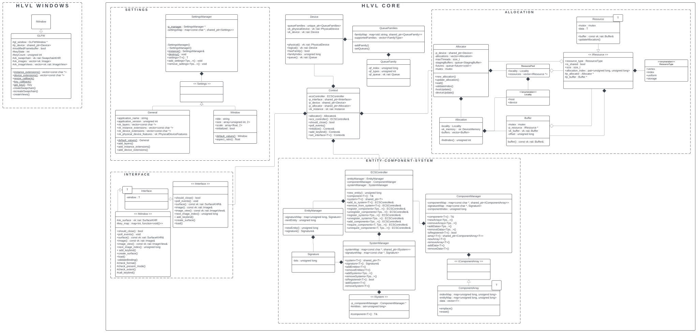

# High Level Vulkan Library

HLVL is a library built to generalize the use of vulkan and ease the development of writing simulations

### Dependencies
- Vulkan 1.3.296.0
- GLFW 3.4.0
- Catch2 3.7.1 *(only if building tests)*
- zsh *(only for building headers. **Planned to change**)*

## Building HLVL

> It is recommended to build HLVL using CMake. One can use their own build system to accomplish this,
> however all steps below will assume the use of CMake since it is just plain easier

1. Create a build directory in the root of your project directory:
    `mkdir <build_directory>` (common practice is to call this directory `build`)
2. Navigate to the build directory: `cd <build_directory>`
3. Create a CMake build configuration (see list of options below): `cmake .. <build_options>`
4. Build the library with the generated build files using your respective build system
5. The library will be located in `<build_directory>/lib`
6. If headers were built, they will be located in `<build_directory>/include`

### Build Options
- `HLVL_GENERATE_HEADERS`: Requires zsh. Generates the hlvl headers with the header generation script
- `HLVL_BUILD_TESTS`: Requires Catch2. Compiles tests for the library
- `HLVL_DEBUG`: Sets debug flags and optimization level to 0

These options are either `ON` or `OFF` and can be configured when generating the CMake build configuration as such: `cmake <source_directory> -DHLVL_GENERATE_HEADERS=<ON/OFF> -DHLVL_BUILD_TESTS=<ON/OFF>`. Make sure to set `-DCMAKE_EXPORT_COMPILE_COMMANDS=ON` if using clangd code intelligence.

> As of right now there is no local install functionality, but there are plans to implement it in the future

## Using HLVL

To begin using HLVL, just include `#include "<path/to/header/directory>/hlvl/hlvl.hpp"` in your c++ project.
When building the project, link to `-l<path/to/library/directory>/libhlvl.a` when compiling.

A general workflow for using this library goes as such:
1. Use the macro `hlvl_global_settings` to modify the global settings for the simulation if needed
2. Create an `hlvl::Context` object
3. Initialize it with `hlvl::Context::initialize()`
4. Get the ECS controller with `hlvl::Context::ecs_controller()`
5. Use the ECS controller to create a simulation

> There is no documentation yet besides this, so if you don't want to read through the source code
> it is best to have some sort of code intelligence active in your editor that way you can
> see a list of functions avaliable to you when working with the HLVL objects

## How HLVL Works

### Global Settings

HLVL has a singleton, `hlvl::Settings`, used to manage settings across all scopes of the simulation. It can be accessed through the macro, `hlvl_global_settings`. Use this to modify the default settings or add your own custom settings if needed.

### HLVL Context

HLVL handles Vulkan completely through the `hlvl::Context` object. This object manages the following:
- `hlvl::ECSController`: Manages the entities, components, and systems used in the simulation
- `hlvl::Interface`: Window, GUI, and keybind information
- `hlvl::Allocator`: Handles memory allocation on the GPU
- `hlvl::Device`: Handles the physical GPU and the logical device related to it
- `vk::Instance`: Instance of vulkan that the simulation is running

The user does not have to worry about setting up any of the objects above. Through a combination of `hlvl_global_settings` and the methods below, once the context is initialized the user can begin using the ECS controller to write their simulation.

#### `Context` Initialization

There are a couple of methods available when setting up a context:
- `set_interface<T>()`: `T` denotes the window type. Default window type is `hlvl::windows::GLFW` if this method is not called.
- `add_keybind(hlvl::Key || { hlvl::Key }, void function )`: Set a new keybind on the interface to call the provided function when the key is pressed.
- `initialize(void * p)`: Must be called to initialize the context. `p` points to a struct that will be used when setting up the vulkan device. This defaults to `nullptr` but if you are using systems that require vulkan extensions, this may need to point to something for the extensions to work properly

#### How `Context` chooses a GPU

Some terminology in case those reading are unfamiliar with vulkan:
- **Queue:** An object that holds commands specific to differnt operations on the GPU
- **Queue Family:** A group of queues
- **Command Buffer:** Buffer containing data about the command wanting to be processed

> The following terms are ones that I use just to make it easier to talk about
> what is happening during initialization of the HLVL context

- **Graphics Queue:** A queue that supports operations on a graphics pipeline
- **Compute Queue:** A queue that supports operations on a compute pipeline
- **Transfer Queue:** A queue that supports transfer operations
- **Sparse Queue:** A queue that supports operations on sparse resources
- **Main Family:** A queue family that contains a graphics queue, compute queue, transfer queue, and supports presentation to a window surface
- **Asynchronous Compute Family:** A queue family that contains just compute queues
- **Asynchronous Transfer Family:** A queue family that contains just transfer queues
- **Asynchronous Family:** A queue family that contains just compute and transfer queues

> Vulkan provides queue families as a way to abstract away the technical details of what is actually happening on the GPU. > In practice, one submits commands to the queues located in a queue family through a command buffer, and then the CPU
> gives the buffer to the GPU which is proccessed by the command proccessing unit (which then propogates the data in the
> buffer through the respective piplines on the gpu).

When choosing a GPU, HLVL goes through each queue family and determines its type.

In order for a GPU to be compatible with HLVL, **the GPU must contain at least one main family**. This is not ideal for simulations as having only one queue family means that you can't exploit the parallelism offered by the GPU when trying to run graphics and compute operations simultaneously.

The method for finding queues goes as such:
1. Get the main queue family
2. Check for async compute and async transfer families
  - if there is an async compute family and async transfer family, use those.
  - if there are 2 async families, use one as an async compute family and the other as an async transfer family
  - if there are 2 main families (not including the one used as the primary main family), use one as an async compute     family and the other as an async transfer family
  - If none of the above are satisfied, the GPU does not have any async queue families.
3. If at any point the queue family is marked as sparse, it is a sparse queue family and is sorted as such.

HLVL will always run graphics operations on the main queue family. This is because the graphics pipeline is the more cumbersome than the compute pipeline. Think of it like keeping the primary logic of your program on a main thread.

HLVL will prioritize running compute and transfer operations on their respective async compute families. If their respective family is not found, HLVL will look for an async family to use. If that does not work, then the operation is given to the main family to run.

Sparse operations can only be run on a sparse family. Attempting to do otherwise will result in an error.

#### System Support

`Context` automatically looks for flags set by vulkan that expect certain vulkan extensions to be enabled in order for vulkan to support the system's architecture. This allows HLVL to work as expected on any system that is running it.

#### Windows

The core module of HLVL doesnt actually have a window manager by default. Only an interface for window managers called `IWindow`. Instead, there is a windows module which contains different classes for different window managers compatible with vulkan. You can also write your own if you so please.

> Right now, there is only one window manager in the windows module -- GLFW. An SDL window class is planned to be made.

##### Making a custom window class

In the `iwindow.hpp` file located in `src/core/include`, there are a list of pure virtual functions that should be satisfied when writing your own window class. The names should be intuitive as to what each function should do.

It is recommended that you create a list of static functions in your window manager as well:
1. a function to return the needed vulkan instance extensions for your window
2. a function to return the needed vulkan device extensions for your window
3. a function that maps your keycodes to the respective `HLVL::Key`
4. a function that is called when your window is resized -- *optional. depends on how you implement resize callbacks*
5. a function that is called when a key is pressed -- *optional. depends on how you implement key callbacks*

### Entity-Component-System (ECS) Architecture

#### What Does This Mean

- Entity: an id of some sort
- Component: continguous storage of data that maps where each index maps to an entity
- System: logic that acts on data given a set of entities

#### Using ECS

There is an order to using ECS architecture:
1. create an entity
2. create a component
3. register the component to the entity
4. create a system
5. register the component to the system
6. add the entity to the system
7. During the event loop, modify data on the entity's component if needed and run the system

Steps 1-6 are usually done before the event loop begins. Think of it as initial setup before the simulation. Of course, if entities are being instantiated during the event loop, there is no harm in going through steps 1-6 for a new entity during the event loop.

#### How HLVL does ECS

All entities, components, and systems are managed with the `ECSController`. The methods are intuitive so it is recommended to check out `ecscontroller_decl.hpp` in `src/core/include` for a list of different ECS functionalities.

In `ECSController`, there are three objects: `EntityManager`, `ComponentManger`, and `SystemManager`. The names mean excatly what they do.

Entities are just unsigned longs in HLVL managed by the entity manager. `EntityManager` keeps track of which entity id to give out next simply by incrementing an index variable. If an entity is valid, `EntityManager` will have a stored signature that maps to the entity.

Components are sorted into an array object called `ComponentArray`. Each component array holds a continguous set of components, each mapped to an entity. Upon registering a new component, `ComponentManager` will initialize a new `ComponentArray` of the component type and give the component a specific index in a 32 bit integer. This does mean that HLVL can only have 32 components at once, but currently this does not seem like a problem.

Systems are user created classes that inherit from `ISystem`. WHen writing logic for your system you have access to the `ComponentManager` and a set of entities to act on. It is up to the user how to implement the system's logic.

Entities and systems both have signatures -- a bitset that keeps track of which components are valid for the entity or system. An entity can only be used by a system if its signature contains the system's signature.

### HLVL Allocator

#### Principle

The idea behind the allocator is to minimizethe complexity that comes with using vulkan to move buffers onto the GPU. HLVL does this by using what we call a `Resource`. A resource is just a piece of data that we specify wants to go onto the gpu. Once you specify to the allocator that you want to allocate a resource, it does the rest for you. After that, the allocator does the rest.

#### How the allocator works

##### Resources and Resource Pools

A `Resource` is just a container for any data you want to store on the GPU. The data can be accessed at any timeby dereferencing the resource, but can only be updated through assignment operators. Whenever the data is updated, if there is an allocation on the GPU the resource will send a message to the allocator to update its allocation with the new data.

When allocating resources onto the gpu, it is best to store data that will be accessed at similar times into the same buffer. HVLV does this by specifying to the allocator a `ResourcePool` rather than just a plain `Resource`. However, Users will never need to create a `ResourcePool` themselves since the allocator requests only a `ResourcePool` temporary.

#### Host-Visible vs. Device-Local Allocations

When allocating data to the GPU, it is important to specify whether the buffer will be entirely on the GPU, or be accessible by the CPU. If the buffer is `Host-Visible`, this means that the CPU (the host) can access and modify contents on the buffer, making modifications to the buffer very easy and CPU heavy while also slowing GPU access times. If the buffer is `Device-Local`, it will be located entirely on the GPU (the device), making GPU access very fast but modification difficult as we must now use a transfer operation to get the data from the CPU to the GPU.

> You can control whether a buffer is host visible or device-local when specifying the resource pool to the allocator. By default, all buffers are device local

##### Modifying a Host-Visible Resource

As soon as a host-visible resource signals to the allocator that its contents have changed, the allocator then does a memcpy of the new data into the area of the buffer the resource occupies.

##### Modifying a Device-Local Resource

It is a little more complicated to modify a device local buffer. The process is as follows:
1. Allocator recieves signal from resource that the resource's data has been modified
2. Allcoator checks if there is an open thread, if not it waits for one to open
3. Allocator starts a new process on a different thread
  1. Allocator checks for an open staging buffer. If there is not one, it creates one
  2. Allocator allocates the new data in the staging buffer
  3. Allocator signals staging buffer to begin the transfer operation
  4. Once the staging buffer finishes, it is put at the back of a queue to be used by another transfer operation

Staging buffers are just host-visible buffers that are used as a mediator between the CPU and the device-local buffer. GPUs are optimized to handle transfer operations which is why HLVL uses this method to get data onto a device-local buffer. In practice, one could get the memory address of the device-local buffer and perform a memcpy on it, however this would block the CPU and would be very inefficient. It is better to leave such things for the GPU to handle.
